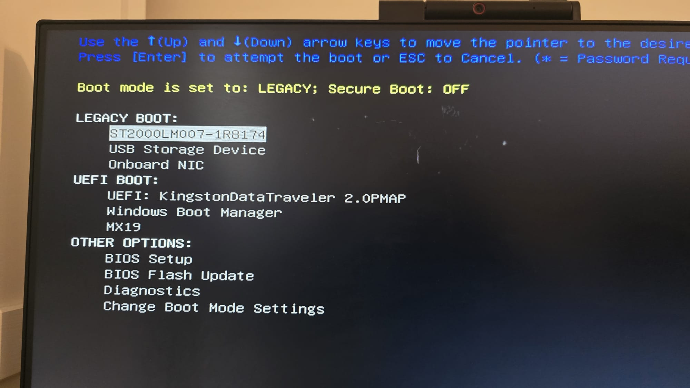

# Upgrading and Repurposing a Dell OptiPlex 3020 into a Home NAS with TrueNAS SCALE

---

## Overview
In this hands-on home lab project, I repurposed a legacy Dell OptiPlex 3020 desktop into a fully functional Network Attached Storage (NAS) system. The project covered hardware upgrades, OS changes, and the installation/configuration of TrueNAS SCALE.

---

## Objectives
- Extend the life of an old PC.
- Build a cost-effective personal cloud solution.
- Practice NAS and SMB setup for home networking.
- Enable centralized file access from multiple devices.

---

## Hardware Upgrades
- **Base System**: Dell OptiPlex 3020
- **Before**:
  - 4GB DDR3 RAM
  - 500GB HDD
  - Windows 8.1
- **After**:
  - 8GB DDR3 RAM (added another 4GB stick)
  - 2TB SATA HDD
  - Bootable USB with TrueNAS SCALE
  - PCIe WiFi & Bluetooth card for wireless access

---

## Software Setup
- Upgraded to Windows 11 temporarily for validation
- Installed TrueNAS SCALE on USB stick via ISO image
- Created datasets (e.g., DocsShare, jsanwo, Media, Photo)
- Configured SMB for Windows and Android file access
- Set static IP for stability on local network
- Created user `jsanwo` with secure credentials and permissions

---

## Challenges
- Initial dataset permission issues (`ix-applications`)
- App Services could not deploy (Tailscale pending)
- UI access issues from mobile due to IP conflicts

> ⚠️ Remote access (e.g., Tailscale) setup is still in progress. This will be a follow-up project.

---

## Screenshots

| Description                   | Preview |
|------------------------------|---------|
| Web UI Dashboard             |  |
| TrueNAS Core Installer       |  |
| SMB Shares                   |  |
| RAM Before Upgrade           |  |
| RAM After Upgrade            |  |
| PCIe WiFi Card Install       |  |
| Windows Network Mapped Drives |  |
| HDD in BIOS Setup            |  |
| Dataset Creation             |  |
| CX File Explorer (Android)   |  |
| BIOS Boot Order              |  |

---

## Outcome
- Transformed a basic PC into a powerful NAS
- Learned ZFS datasets, sharing protocols, and system upgrades
- All shares successfully accessed over LAN
- Future step: configure and secure remote access

---

## Repository
📂 [Project Repo on GitHub](https://github.com/jsanwo85/Dell-optiplex-TrueNas-Upgrade)

---

## Author
**Joseph Oladimeji Sanwo**  
📧 joseph.sanwo1@gmail.com

---

## Tags
#TrueNAS #HomeLab #OpenSource #ITProjects #DellOptiPlex #Cybersecurity #NAS #Networking #SMB #Windows #ZFS
